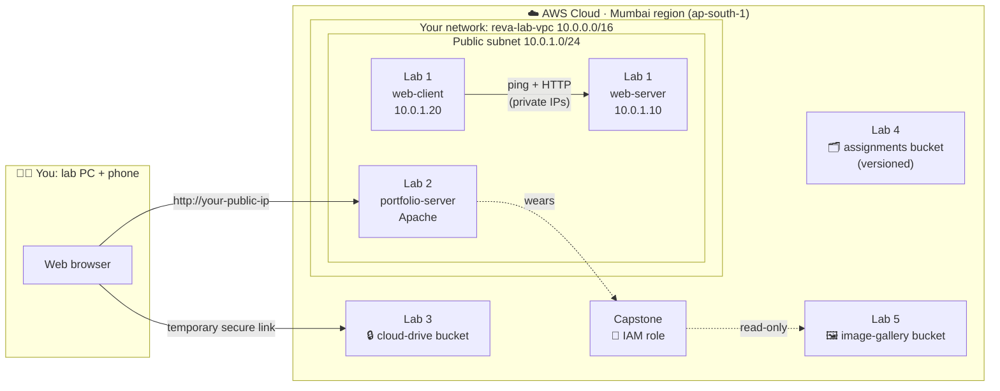

# ☁️ Cloud Computing Lab Day on AWS

**REVA University · B.Sc. (Hons) 3rd Year · Hands-on session (8 hours)**

> By the end of today, **your own website will be live on the internet**, showing a photo gallery that lives in private cloud storage you set up yourself. You'll be able to open it on your phone and send the link to your friends.

Every lab below is something real engineers do at work: building networks, running web servers, storing files securely, keeping version history, and giving servers access to storage without passwords.

---

## 🗺️ What you'll build today

---

## 📅 Plan for the day

| Time | Lab | What you'll have at the end |
|---|---|---|
| 0:00 – 0:30 | [Lab 0 · Getting Started](lab-00-getting-started/README.md) | AWS console set to Mumbai, a **$0 budget alert**, and your lab ID |
| 0:30 – 1:45 | [Lab 1 · Client–Server with Virtual Machines](lab-01-client-server-vms/README.md) | Two Linux servers on your own private network, talking to each other |
| 1:45 – 2:00 | ☕ Break | |
| 2:00 – 3:00 | [Lab 2 · Host Your Personal Website](lab-02-personal-website/README.md) | **Your portfolio site live on the internet**, opened on your phone with a QR code |
| 3:00 – 3:45 | 🍛 Lunch | |
| 3:45 – 4:30 | [Lab 3 · Private Cloud Drive](lab-03-private-cloud-drive/README.md) | Your own Google-Drive-style storage with **links that expire on their own** |
| 4:30 – 5:15 | [Lab 4 · Assignment Submission Box](lab-04-assignment-submission/README.md) | A submission system that keeps **every earlier version** and can undo deletes |
| 5:15 – 5:30 | ☕ Break | |
| 5:30 – 6:15 | [Lab 5 · Cloud Image Gallery](lab-05-image-gallery/README.md) | A photo library with titles, descriptions and file checks |
| 6:15 – 7:15 | [🏆 Capstone · Live Portfolio + Gallery](capstone-live-portfolio-gallery/README.md) | Upload a photo to the cloud and **it appears on your website on its own** |
| 7:15 – 7:45 | 🎤 Showcase + [🧹 Cleanup](cleanup/README.md) | A gallery walk of everyone's sites, then everything deleted so you're never billed |

### How the labs map to your syllabus (Part B)

| Syllabus experiment | Lab in this repo |
|---|---|
| 1 · Setting Up a Client–Server Environment Using Virtual Machines | [Lab 1](lab-01-client-server-vms/README.md) |
| 2 · Hosting a Personal Website on a Virtual Machine | [Lab 2](lab-02-personal-website/README.md) |
| 3 · Private cloud storage service: upload, download, share securely (AWS) | [Lab 3](lab-03-private-cloud-drive/README.md) |
| 4 · Cloud storage for assignment submissions | [Lab 4](lab-04-assignment-submission/README.md) |
| 5 · Cloud-Based Image Gallery Using Amazon S3 | [Lab 5](lab-05-image-gallery/README.md) |
| Bonus: ties experiments 2 and 5 together | [Capstone](capstone-live-portfolio-gallery/README.md) |

---

## ✅ Before you start

- [ ] An **AWS account** that you can sign in to (created with your own email)
- [ ] **Google Chrome** or **Microsoft Edge** on your lab PC
- [ ] This repository downloaded: click the green **`<> Code`** button → **Download ZIP** → extract it. The [`sample-files`](sample-files/) folder has files you can upload if you don't have your own.
- [ ] Your **phone** (for the QR code and gallery moments 📱)
- [ ] Your **lab ID**: your university roll number in **lowercase**, e.g. `r23bsc042`. Every name you create today starts with it, so nobody's names clash.

> [!IMPORTANT]
> Wherever a guide says **`<your-id>`**, type **your own lab ID** in its place. Example: `<your-id>-cloud-drive` becomes `r23bsc042-cloud-drive`.

---

## 🧭 How to read these guides

| Symbol | Meaning |
|---|---|
| ✅ **Checkpoint** | Stop and make sure you see the same thing before moving on |
| 📸 **Screenshot** | Take this screenshot for your lab report ([report template](resources/report-template.md)) |
| 💥 **Break it on purpose** | We break something deliberately so you understand *why* it works |
| 🚀 **Power-up** | Optional: the same task done with the command line, the way professionals work |
| 🧠 **Check your understanding** | Viva-style questions with answers hidden underneath. Try before you peek! |

`Text like this` is something you type or click exactly as shown.

---

## 💰 Staying at ₹0

All labs use **Free Tier** resources in the **Mumbai (ap-south-1)** region.

1. Lab 0 sets up a **zero-spend budget alert**, so AWS emails you if anything ever costs money.
2. The [Cleanup guide](cleanup/README.md) deletes everything at the end of the day. **Don't skip it.**

---

## 🆘 Stuck?

1. Check the **[Troubleshooting guide](resources/troubleshooting.md)**. Most problems are listed there with a fix.
2. Check the **region** in the top-right of the AWS console. It must say **Asia Pacific (Mumbai)**.
3. Raise your hand 🙋 and your facilitator will come to you.

---

Facilitator: Afzal · Built for REVA University · Diagrams use Mermaid and render directly on GitHub.
