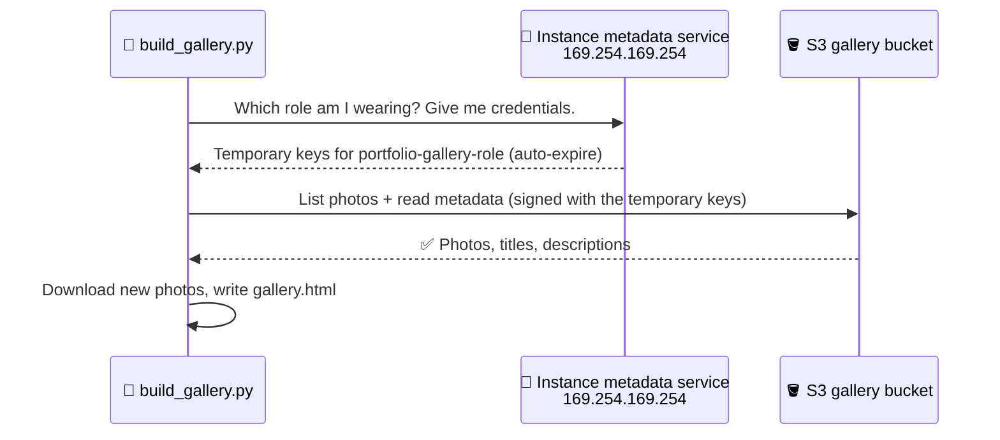

# 🏆 Capstone · Live Portfolio + Cloud Gallery

⏱️ **60 minutes** · 🎯 **Goal:** Connect your **website (Lab 2)** to your **private photo bucket (Lab 5)**, so that uploading a photo to S3 makes it **appear on your website on its own**, with no passwords stored anywhere.

[🏠 Home](../README.md) · [← Lab 5](../lab-05-image-gallery/README.md) · Next: [🧹 Cleanup →](../cleanup/README.md)

**You need:** `portfolio-server` still running (Lab 2) and your `<your-id>-image-gallery` bucket with photos and metadata (Lab 5).

---

## 🧠 Concept in 60 seconds

Your web server needs to **read** your private bucket. How do you give a server permission?

| ❌ The wrong way | ✅ The right way |
|---|---|
| Create access keys (a username/password for AWS) and paste them into a file on the server | Give the server an **IAM role**: an identity it "wears" |
| If the server is hacked, the keys leak **and work forever** | Credentials are **temporary**, **rotated automatically**, and never written in your code |
| Keys often get pushed to GitHub by accident 😱 | Nothing secret exists to leak |

An **IAM role** is like a **visitor ID badge 🎫**: it says *what* the holder may do (only **read** the gallery bucket), and AWS swaps in a fresh badge every few hours.

## 🏗️ Architecture

```mermaid
flowchart LR
    V["📱 Visitors"] -- "http://public-ip/gallery.html" --> AP
    subgraph AWS["☁️ AWS · Mumbai"]
        subgraph EC2["🖥️ portfolio-server"]
            AP["Apache :80"] --> WEB["📁 /var/www/html<br/>gallery.html + gallery/*.jpg"]
            CRON["⏰ cron<br/>every 2 minutes"] --> PY["🐍 build_gallery.py"]
            PY -- "writes" --> WEB
        end
        ROLE["🎫 IAM role<br/>portfolio-gallery-role<br/>read-only on the gallery bucket"]
        S3["🪣 your-id-image-gallery<br/>🔒 private · Block Public Access ON<br/>Family/ never published"]
    end
    ROLE -. "temporary credentials" .-> PY
    PY -- "List + Get<br/>(read-only)" --> S3
    YOU["👩‍💻 You upload a photo<br/>in the S3 console"] --> S3
```



**How the script gets its credentials:**



---

## Step 1 · Prepare the server

Connect to **portfolio-server** (EC2 Instance Connect), then run:

```bash
sudo timedatectl set-timezone Asia/Kolkata     # show Indian time on the gallery page
cd ~/reva-cloud-labs && git pull               # get the latest version of the lab files
sudo apt update && sudo apt install -y python3-boto3    # the AWS library for Python
```

✅ **Checkpoint:** `python3 -c "import boto3; print(boto3.__version__)"` prints a version number.

---

## Step 2 · 💥 Break it on purpose: try without permission

Replace `<your-id>` and run the gallery builder:

```bash
sudo python3 ~/reva-cloud-labs/capstone-live-portfolio-gallery/build_gallery.py --bucket <your-id>-image-gallery
```

❌ Result: **`No AWS credentials found`**. The server has no identity yet, so AWS doesn't know who is asking. Let's give it a badge. 🎫

---

## Step 3 · Create a least-privilege policy

A **policy** is a JSON document listing exactly what is allowed.

1. Search **`IAM`** → **Policies** → **Create policy**.
2. Switch the Policy editor to **JSON**, delete what's there, and paste the policy below. **Replace `YOUR-ID` in both places** with your lab ID, e.g. `arn:aws:s3:::r23bsc042-image-gallery`:

   ```json
   {
     "Version": "2012-10-17",
     "Statement": [
       {
         "Sid": "ListMyGalleryBucket",
         "Effect": "Allow",
         "Action": "s3:ListBucket",
         "Resource": "arn:aws:s3:::YOUR-ID-image-gallery"
       },
       {
         "Sid": "ReadMyGalleryPhotos",
         "Effect": "Allow",
         "Action": "s3:GetObject",
         "Resource": "arn:aws:s3:::YOUR-ID-image-gallery/*"
       }
     ]
   }
   ```

3. **Next** → Policy name: `gallery-read-only` → **Create policy**.

> [!NOTE]
> Read it like a sentence: *"Allow **listing** the gallery bucket, and allow **reading** any object (`/*`) inside it."* Nothing else. It can't upload, can't delete, and can't touch any other bucket. This is the **principle of least privilege**.

---

## Step 4 · Create the IAM role

1. **IAM → Roles → Create role**.
2. Trusted entity type: **AWS service** → Use case: **EC2** → **Next**.
3. Search for **`gallery-read-only`** and tick it → **Next**.
4. Role name: `portfolio-gallery-role` → **Create role**.

> [!TIP]
> "Trusted entity: EC2" means **only EC2 instances** are allowed to wear this role.

---

## Step 5 · Attach the role to your server

1. **EC2 → Instances** → select **portfolio-server**.
2. **Actions → Security → Modify IAM role**.
3. Choose **`portfolio-gallery-role`** → **Update IAM role**.

Back in the terminal, ask AWS *"who am I?"*:

```bash
python3 -c "import boto3; print(boto3.client('sts', region_name='ap-south-1').get_caller_identity()['Arn'])"
```

✅ **Checkpoint:** You see something like
`arn:aws:sts::123456789012:assumed-role/portfolio-gallery-role/i-0abc123...`.
The server is now wearing the role. 🎫

<details>
<summary>🔍 Behind the scenes: see the temporary credentials</summary>

Every EC2 instance can reach a special internal address, `169.254.169.254` (the **instance metadata service**), which hands out the role's credentials:

```bash
TOKEN=$(curl -sX PUT http://169.254.169.254/latest/api/token -H "X-aws-ec2-metadata-token-ttl-seconds: 60")
curl -s -H "X-aws-ec2-metadata-token: $TOKEN" \
  http://169.254.169.254/latest/meta-data/iam/security-credentials/portfolio-gallery-role | grep -E '"Code"|"Expiration"'
```

Notice the **Expiration** time. These keys expire on their own, and AWS rotates them automatically. Your code never stores them.
</details>

---

## Step 6 · Build the gallery 🎉

```bash
sudo python3 ~/reva-cloud-labs/capstone-live-portfolio-gallery/build_gallery.py --bucket <your-id>-image-gallery
```

You'll see each photo download with its **title** from the metadata:

```
⬇️  Nature/mountain-dawn.jpg  ·  Dawn over the Western Ghats
⬇️  Events/tech-talk.jpg  ·  Tech Talk
...
✅ [14:32:10] 9 photos published (9 downloaded, 0 removed) → /var/www/html/gallery.html
```

Open **`http://<your-public-ip>/gallery.html`**, or click **📷 Photo gallery** on your portfolio. The 🔒 *Coming soon* page is now a **real gallery**, grouped into albums, with your titles and descriptions. Click any photo to view it full-size.

✅ **Checkpoint:** Your gallery shows **Nature, Events and Travel**, and **Family is not there**. 🏠 Family photos stay private in S3 and are never published.

📸 **Screenshot:** Your live gallery page.

---

## Step 7 · 💥 Test least privilege

Try to read your **cloud-drive** bucket from Lab 3 using the same server:

```bash
python3 -c "import boto3; boto3.client('s3', region_name='ap-south-1').list_objects_v2(Bucket='<your-id>-cloud-drive')"
```

❌ A long error that ends with **`AccessDenied`**. The role can read **only** the gallery bucket. If this server were ever hacked, the attacker couldn't touch your other data. ✅

---

## Step 8 · Automate it (the magic ✨)

Tell Linux to run the script **every 2 minutes** with **cron**, the built-in task scheduler. Replace `<your-id>`, then paste:

```bash
BUCKET=<your-id>-image-gallery
echo "*/2 * * * * root /usr/bin/python3 /home/ubuntu/reva-cloud-labs/capstone-live-portfolio-gallery/build_gallery.py --bucket $BUCKET >> /var/log/gallery-sync.log 2>&1" | sudo tee /etc/cron.d/gallery-sync
```

<details>
<summary>🔍 What does <code>*/2 * * * *</code> mean?</summary>

The five fields are **minute · hour · day of month · month · day of week**. `*/2` in the minute field means "every 2nd minute", and `*` means "every". So: *every 2 minutes, every hour, every day*.
</details>

Watch the sync log:

```bash
sudo tail -f /var/log/gallery-sync.log
```

### 🎬 The moment

1. On your **lab PC or phone**, open the S3 console → your gallery bucket → **Events/** → **Upload** a new photo (the lab selfie you took!).
2. Before clicking Upload, expand **Properties → Metadata → Add metadata** → *User defined*: `title` = `Cloud Lab Day at REVA` and `description` = `Where it all started ☁️`. Then click **Upload**.
3. Keep your **gallery page** open. It refreshes itself every 2 minutes.
4. Within about 2 minutes, the log prints `⬇️ Events/...` and **your photo appears on your live website**. 🤯

Now try these:

| Try this in S3… | …and watch your website |
|---|---|
| **Delete** a photo | It disappears within 2 minutes 🗑️ |
| Upload a photo to **Family/** | It **never** appears 🔒 |
| **Edit metadata** (title) of a photo | The new title shows up ✏️ |

Press `Ctrl + C` to stop watching the log. The sync keeps running in the background.

📸 **Screenshot:** The log showing the new photo, and the gallery with that photo on it.

---

## Step 9 · 🎤 Showcase

```bash
qrencode -t ANSIUTF8 "http://$(curl -s https://checkip.amazonaws.com)/gallery.html"
```

Share your QR code or URL with the class. 🏆 **Gallery walk:** visit your classmates' sites and vote for the best portfolio!

---

## 🎓 What you just built

You combined **everything** from today into one working system:

| Concept | Where it came from |
|---|---|
| Virtual machine + networking | Labs 1 & 2 |
| Web server + HTML/CSS | Lab 2 |
| Private, encrypted object storage | Labs 3 & 5 |
| Object metadata | Lab 5 |
| **IAM role + least privilege** | Capstone |
| **Automation with cron + Python** | Capstone |

### 🚀 How would a company make this production-grade?

| Today | In production |
|---|---|
| `http://` with an IP address | A **domain name** + **HTTPS** certificate (free with AWS Certificate Manager) |
| One server | **Auto Scaling group** behind a **load balancer** |
| Cron checks every 2 minutes | **S3 Event Notifications → AWS Lambda** reacts instantly |
| Photos copied to the server | **Amazon CloudFront** serves them directly from the private bucket (Origin Access Control) |

---

## 🧠 Check your understanding

<details>
<summary><b>1. Why is an IAM role safer than putting access keys on the server?</b></summary>

Role credentials are **temporary** and **rotated automatically** by AWS, and they're never saved in code or files. Access keys are long-lived: if they leak (a hacked server, or a GitHub push), they keep working until someone notices and deletes them.
</details>

<details>
<summary><b>2. What is the principle of least privilege? Where did you apply it?</b></summary>

Give an identity **only** the permissions it needs, and nothing more. Our role can only **list and read** the **gallery** bucket. Step 7 proved it can't read the cloud-drive bucket.
</details>

<details>
<summary><b>3. What are the two parts of an IAM role?</b></summary>

(1) A **trust policy**: *who* may use the role (here, the EC2 service). (2) A **permissions policy**: *what* the role may do (here, `gallery-read-only`).
</details>

<details>
<summary><b>4. The bucket is private, so how can visitors see the photos?</b></summary>

Visitors never talk to S3. The **server** reads the bucket with its role and copies only the chosen albums into Apache's document root. Visitors get the photos from **Apache**, and the bucket itself stays private.
</details>

<details>
<summary><b>5. What would change if you used S3 Event Notifications + Lambda instead of cron?</b></summary>

Instead of **polling** every 2 minutes (and making requests even when nothing changed), S3 would **push** an event the moment a photo is uploaded, and a Lambda function would react instantly. That's faster and cheaper: **event-driven** instead of scheduled.
</details>

---

[🏠 Home](../README.md) · [← Lab 5](../lab-05-image-gallery/README.md) · Next: [🧹 Cleanup →](../cleanup/README.md)
