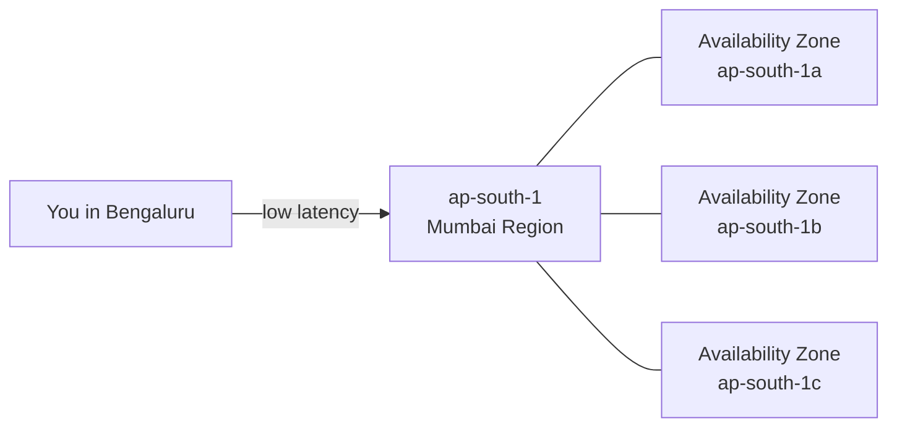

# Lab 0 · Getting Started with the AWS Console

⏱️ **30 minutes** · 🎯 **Goal:** Get your AWS account ready and protected before building anything.

[🏠 Home](../README.md) · Next: [Lab 1 →](../lab-01-client-server-vms/README.md)

---

## 🧠 Concept in 60 seconds

**Cloud computing** means renting computers, storage and networks from a provider (here, **Amazon Web Services**) over the internet, instead of buying hardware. You pay only for what you use, and today you'll stay inside the **Free Tier**.

AWS has data centres all over the world, grouped into **Regions**. We'll use **Asia Pacific (Mumbai) — `ap-south-1`**, the region closest to Bengaluru, so things feel fast.



> An **Availability Zone (AZ)** is one or more separate data centres inside a region. A region has several AZs so that if one fails, the others keep running.

---

## Step 1 · Sign in

1. Open **https://console.aws.amazon.com** in Chrome or Edge.
2. Sign in with the email and password you used to create your AWS account.
3. You land on the **Console Home** page.

✅ **Checkpoint:** You can see "Console Home" and your account name in the top-right corner.

---

## Step 2 · Switch to the Mumbai region

1. In the **top-right**, click the region name (it may say *N. Virginia* or something else).
2. Choose **Asia Pacific (Mumbai) ap-south-1**.

> [!WARNING]
> **Check the region every time you open a new AWS page.** Resources in one region are invisible from another. "My server disappeared!" almost always means the region changed.

✅ **Checkpoint:** The top-right shows **Mumbai**.

---

## Step 3 · Set up a $0 budget alert (your safety net)

This makes AWS **email you the moment anything costs even 1 cent**.

1. In the search bar at the top, type **`Budgets`** and open **Budgets** (under *Billing and Cost Management*).
2. Click **Create budget**.
3. Choose **Use a template (simplified)**.
4. Select the template **Zero spend budget**.
5. Budget name: `zero-spend-alert`
6. Email recipients: **your email address**
7. Click **Create budget**.

✅ **Checkpoint:** `zero-spend-alert` appears in your list of budgets.

📸 **Screenshot:** The Budgets page showing your zero-spend budget.

> [!NOTE]
> Accounts created after mid-2025 are on AWS's newer **Free plan** with free credits, and you can see the credits left on the **Billing** home page. Older accounts have the classic **12-month Free Tier**. Both are fine for today.

---

## Step 4 · Open AWS CloudShell (your terminal in the cloud)

**CloudShell** is a free Linux terminal in your browser that's already signed in to your AWS account. We'll use it for the optional 🚀 Power-ups.

1. Click the **`>_`** icon in the top navigation bar (next to the search box), or search **`CloudShell`**.
2. Wait about a minute the first time while it sets up.
3. Run:

   ```bash
   aws sts get-caller-identity
   ```

   You'll see your **Account ID** and your **Arn** (your identity in AWS).

4. Save your lab ID so the Power-ups can use it. **Replace `r23bsc042` with your own lab ID**:

   ```bash
   echo 'export ID=r23bsc042' >> ~/.bashrc
   source ~/.bashrc
   echo "My lab ID is $ID"
   ```

✅ **Checkpoint:** The last command prints your lab ID.

> [!TIP]
> CloudShell keeps your home folder between sessions (per region), so `$ID` will still be set later today.

---

## Step 5 · Know your tools for today

Use the search bar at the top to jump to any of these services:

| Service | What it is | Used in |
|---|---|---|
| **EC2** | Virtual machines ("instances") | Labs 1, 2, Capstone |
| **VPC** | Your own private network in the cloud | Lab 1 |
| **S3** | Storage for any file ("objects") in containers ("buckets") | Labs 3, 4, 5, Capstone |
| **IAM** | Who is allowed to do what | Capstone |
| **CloudShell** | Browser terminal | 🚀 Power-ups |

> [!TIP]
> Click the ☆ star next to a service in the search results to pin it to your top bar.

---

## 🧠 Check your understanding

<details>
<summary><b>1. What is the difference between a Region and an Availability Zone?</b></summary>

A **Region** is a geographic area (e.g. Mumbai). It contains several isolated **Availability Zones**, each made of one or more data centres with their own power and networking. Spreading an application across AZs keeps it running if one data centre fails.
</details>

<details>
<summary><b>2. Why did we choose the Mumbai region?</b></summary>

It is the closest region to Bengaluru, so it has the **lowest latency** (fastest response). Choosing a region also affects cost, which services are available, and **data residency** (where the data physically lives, which can matter by law).
</details>

<details>
<summary><b>3. Name the three cloud service models and give one AWS example of each.</b></summary>

- **IaaS** (Infrastructure as a Service): EC2 (you manage the OS)
- **PaaS** (Platform as a Service): Elastic Beanstalk (you bring code, AWS manages the platform)
- **SaaS** (Software as a Service): Amazon WorkMail, or Gmail outside AWS (you just use the software)
</details>

---

[🏠 Home](../README.md) · Next: [Lab 1 · Client–Server with Virtual Machines →](../lab-01-client-server-vms/README.md)
