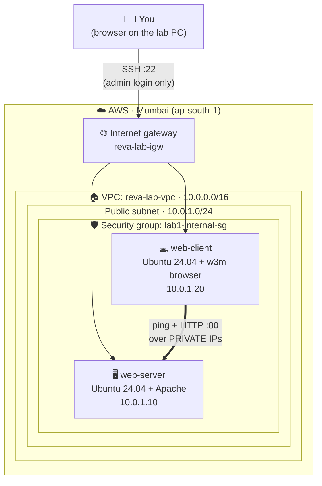

# Lab 1 · Setting Up a Client–Server Environment Using Virtual Machines

⏱️ **75 minutes** · 🎯 **Goal:** Build a private network in the cloud, put two Ubuntu virtual machines on it with fixed IP addresses, and make one serve a web page to the other.

[🏠 Home](../README.md) · [← Lab 0](../lab-00-getting-started/README.md) · Next: [Lab 2 →](../lab-02-personal-website/README.md)

**Syllabus tasks covered:** create two Ubuntu VMs · internal/host-only network · static IP addresses · ping test · Apache on one VM · open the page from the second VM in a browser · document the network setup

---

## 🧠 Concept in 60 seconds

On your own laptop you would do this lab in **VirtualBox**. In the cloud, the same ideas have different names:

| On your laptop (VirtualBox) | In the cloud (AWS) |
|---|---|
| Virtual machine | **EC2 instance** |
| Ubuntu ISO file | **AMI** (Amazon Machine Image) |
| Host-only / Internal network | **VPC** (Virtual Private Cloud) + **subnet** |
| Static IP set in netplan | **Primary private IP** chosen at launch |
| Windows Firewall / `ufw` | **Security group** (a firewall around each VM) |
| NAT adapter (to reach the internet) | **Internet gateway** |

## 🏗️ Architecture



The web page is only reachable **from inside the network**, just like a host-only network. You'll prove this in Step 9.

---

## Step 1 · Create your private network (VPC)

1. Search **`VPC`** in the top search bar and open **VPC**. Confirm the region is **Mumbai**.
2. Click **Create VPC**.
3. Fill in exactly:

   | Setting | Value |
   |---|---|
   | Resources to create | **VPC and more** |
   | Name tag auto-generation | ✅ Auto-generate · `reva-lab` |
   | IPv4 CIDR block | `10.0.0.0/16` |
   | IPv6 CIDR block | No IPv6 CIDR block |
   | Number of Availability Zones | **1** |
   | Number of public subnets | **1** |
   | Number of private subnets | **0** |
   | Customize subnets CIDR blocks → Public subnet | `10.0.1.0/24` |
   | NAT gateways | **None** ⚠️ |
   | VPC endpoints | **None** |

4. Look at the **Preview** diagram on the right. You should see one VPC, one subnet, one route table and one internet gateway.
5. Click **Create VPC** and wait until every step shows ✅, then click **View VPC**.

> [!CAUTION]
> Make sure **NAT gateways = None**. A NAT gateway costs money every hour, even while you're not using it.

6. Open the **Resource map** tab of your VPC.

📸 **Screenshot:** The VPC **Resource map**. It's the best network diagram for your report.

<details>
<summary>💡 What do these numbers mean? (CIDR in 30 seconds)</summary>

`10.0.0.0/16` means "all addresses starting with `10.0.`", which is 65,536 addresses. Your subnet `10.0.1.0/24` is the slice `10.0.1.0` to `10.0.1.255` (256 addresses). AWS reserves 5 of them in every subnet:

| Address | Reserved for |
|---|---|
| `10.0.1.0` | Network address |
| `10.0.1.1` | VPC router (your default gateway) |
| `10.0.1.2` | AWS DNS server |
| `10.0.1.3` | Reserved for future use |
| `10.0.1.255` | Broadcast |

So `10.0.1.10` and `10.0.1.20` are safe to use.
</details>

---

## Step 2 · Create the firewall (security group)

1. Search **`EC2`** and open it. In the left menu, go to **Network & Security → Security Groups**.
2. Click **Create security group**:

   | Setting | Value |
   |---|---|
   | Security group name | `lab1-internal-sg` |
   | Description | `Lab 1 - SSH for admin, HTTP only inside the VPC` |
   | VPC | **reva-lab-vpc** (⚠️ not the default VPC) |

3. Under **Inbound rules**, click **Add rule** twice:

   | Type | Source | Why |
   |---|---|---|
   | SSH | Anywhere-IPv4 (`0.0.0.0/0`) | So you can log in from the browser (EC2 Instance Connect) |
   | HTTP | Custom · `10.0.0.0/16` | Web traffic is allowed **only from inside our VPC** |

4. Leave **Outbound rules** as they are, then click **Create security group**.

> [!NOTE]
> We are **not** allowing ping (ICMP) yet. That's on purpose, see Step 6 💥.

---

## Step 3 · Launch the server VM (`web-server`)

1. Go to **EC2 → Instances → Launch instances**.
2. Fill in:

   | Setting | Value |
   |---|---|
   | Name | `web-server` |
   | Application and OS Images | **Ubuntu** → **Ubuntu Server 24.04 LTS** (shows *Free tier eligible*) |
   | Instance type | `t3.micro` or `t2.micro`, whichever shows **Free tier eligible** |
   | Key pair | **Create new key pair** → name `reva-lab-key` → RSA → `.pem` → **Create** (it downloads; keep it as a backup) |

3. In **Network settings**, click **Edit** and set:

   | Setting | Value |
   |---|---|
   | VPC | **reva-lab-vpc** |
   | Subnet | **reva-lab-subnet-public1-…** |
   | Auto-assign public IP | **Enable** |
   | Firewall (security groups) | **Select existing security group** → `lab1-internal-sg` |
   | ▸ Advanced network configuration → **Primary IP** | `10.0.1.10` |

4. Leave **Storage** at the default (8 GiB), then click **Launch instance**.

> [!TIP]
> The **Primary IP** field is how you give a cloud VM a **static IP address**. The VM keeps this private IP through reboots and stop/start, for as long as the VM exists.

---

## Step 4 · Launch the client VM (`web-client`)

Repeat Step 3 with **three differences**:

| Setting | Value |
|---|---|
| Name | `web-client` |
| Key pair | Select the existing `reva-lab-key` |
| Primary IP | `10.0.1.20` |

✅ **Checkpoint:** On **EC2 → Instances** you see both VMs **Running**, with private IPs `10.0.1.10` and `10.0.1.20`. Wait until **Status check** says *2/2 checks passed* (about 1–2 minutes).

📸 **Screenshot:** The Instances list showing both VMs with their private IPs.

---

## Step 5 · Log in to both VMs and set their names

1. Select **web-server** → **Connect** → **EC2 Instance Connect** tab → Username `ubuntu` → **Connect**. A terminal opens in a new tab.
2. Do the same for **web-client** in another tab. Keep **both tabs open** for the rest of the lab.

Run these on **BOTH** VMs. They give each machine a phone book (`/etc/hosts`) so you can use names instead of IPs:

```bash
echo "10.0.1.10  web-server" | sudo tee -a /etc/hosts
echo "10.0.1.20  web-client" | sudo tee -a /etc/hosts
```

Now give each VM its name. Run the matching command in the matching tab:

```bash
# In the web-server tab:
sudo hostnamectl set-hostname web-server && exec bash
```

```bash
# In the web-client tab:
sudo hostnamectl set-hostname web-client && exec bash
```

Now check the network settings on each VM:

```bash
hostname          # the machine's name
hostname -I       # its private IP address
ip -4 addr        # network interfaces and their addresses
ip route          # "default via 10.0.1.1" is the VPC router
```

✅ **Checkpoint:** Your prompt now looks like `ubuntu@web-server:~$` and `ubuntu@web-client:~$`, and `hostname -I` shows `10.0.1.10` or `10.0.1.20`.

<details>
<summary>🔍 Where is the "static IP" configured inside Ubuntu?</summary>

```bash
sudo cat /etc/netplan/50-cloud-init.yaml
```

You'll see `dhcp4: true`. On AWS, the VPC's DHCP server **always gives this VM the same address you chose at launch**, so it behaves as a static IP without editing any files.

**On VirtualBox** (host-only adapter) you would set the static IP yourself in netplan:

```yaml
network:
  version: 2
  ethernets:
    enp0s8:
      addresses: [192.168.56.10/24]
```

and then run `sudo netplan apply`. Same idea, done by hand.
</details>

---

## Step 6 · 💥 Break it on purpose: test connectivity with ping

In the **web-client** tab:

```bash
ping -c 4 10.0.1.10
```

❌ Result: **`100% packet loss`**. Both machines are on the same network, so why did it fail?

> **The security group is blocking ping.** Ping uses a protocol called **ICMP**, and we didn't allow it. Firewalls block everything unless a rule allows it.

**Fix it:**

1. Go to **EC2 → Security Groups → `lab1-internal-sg` → Inbound rules → Edit inbound rules**.
2. **Add rule:** Type **All ICMP - IPv4** · Source **Custom** `10.0.0.0/16` → **Save rules**.

Try again from **web-client**:

```bash
ping -c 4 10.0.1.10
ping -c 4 web-server      # using the name from /etc/hosts
```

And from **web-server**, ping the client back:

```bash
ping -c 4 web-client
```

✅ **Checkpoint:** `4 packets transmitted, 4 received, 0% packet loss`. Response times should be **under 1 ms**, because both machines are in the same data centre.

📸 **Screenshot:** Failed ping, the new ICMP rule, and the successful ping.

---

## Step 7 · Install Apache Web Server on `web-server`

In the **web-server** tab:

```bash
sudo apt update
sudo apt install -y apache2
systemctl status apache2 --no-pager
```

✅ **Checkpoint:** The status shows **`active (running)`** in green.

> [!TIP]
> If `apt` says **"Could not get lock"**, the VM is still installing updates from its first boot. Wait 1–2 minutes and try again.

Replace the default page with one that says which machine served it:

```bash
sudo tee /var/www/html/index.html > /dev/null <<EOF
<!DOCTYPE html>
<html>
<head><title>Lab 1 - $(hostname)</title></head>
<body style="font-family:sans-serif;text-align:center;padding-top:40px">
  <h1>Hello from $(hostname)!</h1>
  <p>I am the <b>SERVER</b>. My private IP is <b>$(hostname -I)</b></p>
  <p>Apache on AWS EC2, page created on $(date)</p>
</body>
</html>
EOF

curl localhost
```

✅ **Checkpoint:** `curl localhost` prints your HTML with `Hello from web-server!`.

---

## Step 8 · Open the web page from the client VM (with a browser!)

Ubuntu Server has no desktop, so we'll use **w3m**, a **web browser that runs inside the terminal**.

In the **web-client** tab:

```bash
curl http://web-server              # raw HTML
sudo apt install -y w3m             # a text-mode web browser
w3m http://web-server               # open the page in the browser
```

Inside w3m, press **`q`** then **`y`** to quit.

✅ **Checkpoint:** w3m shows **"Hello from web-server! I am the SERVER…"**. The client got the page from the server over the private network. 🎉 **That's a working client–server environment.**

📸 **Screenshot:** The w3m browser on web-client showing the server's page.

---

## Step 9 · 💥 Prove the network is private

1. In **EC2 → Instances**, copy the **Public IPv4 address** of **web-server**.
2. On your **lab PC**, open a browser and go to `http://<that-public-ip>`.

❌ The page **keeps loading and then times out**. That's correct! Our HTTP rule only allows `10.0.0.0/16`, and your PC is outside the VPC. The server is reachable only from inside the network, like a **host-only** network.

### One more experiment: "timeout" vs "refused"

In the **web-server** tab, stop Apache:

```bash
sudo systemctl stop apache2
```

In the **web-client** tab:

```bash
curl http://web-server
```

You get **`Connection refused`** *immediately*, not a timeout. Why is it different?

| Error | What it means |
|---|---|
| **Timeout** (Step 9 from your PC) | A **firewall silently dropped** the request. Nothing answered. |
| **Connection refused** | The request **reached the machine**, but **no program is listening** on port 80. |

Start Apache again:

```bash
sudo systemctl start apache2
```

> [!TIP]
> This is one of the most useful debugging skills in networking. Engineers read these two errors every day.

---

## Step 10 · Document the network configuration

Run this on **each** VM and copy the output into your report:

```bash
echo "=== $(hostname) ==="; hostname -I; ip -4 addr; ip route; cat /etc/hosts
```

📸 **Screenshots for your report:**

- [ ] VPC **Resource map** (Step 1)
- [ ] Security group **inbound rules** (with the ICMP rule)
- [ ] Instances list with both private IPs
- [ ] Ping failing ❌ and then succeeding ✅
- [ ] w3m showing the server's page from the client
- [ ] Browser timeout from your lab PC (proof that the network is private)

---

## Step 11 · Clean up this lab

We don't need these two VMs any more.

1. **EC2 → Instances** → select **web-server** and **web-client**.
2. **Instance state → Terminate (delete) instance → Terminate**.

> [!IMPORTANT]
> **Keep the VPC `reva-lab-vpc`** and the key pair. You'll reuse them in Lab 2. (A VPC on its own is free.)

---

## 🧠 Check your understanding

<details>
<summary><b>1. Ping failed at first even though both VMs were on the same subnet. Why?</b></summary>

The **security group** had no rule allowing **ICMP**, the protocol ping uses. Security groups deny all inbound traffic unless a rule explicitly allows it.
</details>

<details>
<summary><b>2. What is the difference between a private IP and a public IP?</b></summary>

A **private IP** (like `10.0.1.10`) works only inside the VPC. It isn't reachable from the internet, and it stays with the instance until you terminate it. A **public IP** is reachable from the internet through the internet gateway. By default it **changes if you stop and start** the instance. For a permanent public IP, AWS offers an **Elastic IP**.
</details>

<details>
<summary><b>3. What is the difference between "Connection timed out" and "Connection refused"?</b></summary>

**Timed out:** nothing replied, usually because a firewall dropped the packets. **Refused:** the machine replied "nothing is listening on that port", so the network is fine but the service is down.
</details>

<details>
<summary><b>4. Security groups are "stateful". What does that mean?</b></summary>

If a request is allowed **in**, the reply is automatically allowed **out** (and the other way round). That's why web-client can ping `8.8.8.8` on the internet and get replies, even though no inbound rule allows traffic from `8.8.8.8`.
</details>

<details>
<summary><b>5. Which VirtualBox network mode is our setup most similar to, and why?</b></summary>

**Host-only / Internal network**: the two VMs talk to each other on private addresses, and the web service is not reachable from outside. The difference is that our VMs can still *go out* to the internet (for `apt install`) through the internet gateway, similar to adding a NAT adapter in VirtualBox.
</details>

---

[🏠 Home](../README.md) · [← Lab 0](../lab-00-getting-started/README.md) · Next: [Lab 2 · Host Your Personal Website →](../lab-02-personal-website/README.md)
