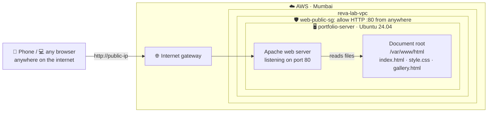
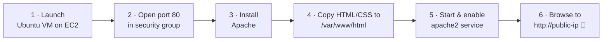

# Lab 2 · Hosting a Personal Website on a Virtual Machine

⏱️ **60 minutes** · 🎯 **Goal:** Deploy a static website on an Ubuntu VM with Apache, reachable by **anyone on the internet**, including your phone.

[🏠 Home](../README.md) · [← Lab 1](../lab-01-client-server-vms/README.md) · Next: [Lab 3 →](../lab-03-private-cloud-drive/README.md)

**Syllabus tasks covered:** create an Ubuntu VM · install Apache · create a portfolio page with HTML and CSS · place it in the Apache document root · start the Apache service · open the site using the VM's IP · explain the deployment steps

---

## 🧠 Concept in 60 seconds

A **web server** is a program that waits for browsers to ask for pages and sends back files. **Apache** is one of the most widely used web servers in the world. When someone visits `http://<your-ip>/`, Apache looks in its **document root** folder, `/var/www/html`, and sends back `index.html`.

In Lab 1 the web page was **private**. Today we open port 80 to the whole internet.

## 🏗️ Architecture



---

## Step 1 · Create a public firewall (security group)

1. **EC2 → Security Groups → Create security group**

   | Setting | Value |
   |---|---|
   | Name | `web-public-sg` |
   | Description | `Lab 2 - public website` |
   | VPC | **reva-lab-vpc** |

2. **Inbound rules:**

   | Type | Source |
   |---|---|
   | SSH | Anywhere-IPv4 `0.0.0.0/0` |
   | HTTP | Anywhere-IPv4 `0.0.0.0/0` 🌍 |

3. **Create security group**.

---

## Step 2 · Launch the Ubuntu VM

**EC2 → Instances → Launch instances**

| Setting | Value |
|---|---|
| Name | `portfolio-server` |
| AMI | **Ubuntu Server 24.04 LTS** (Free tier eligible) |
| Instance type | `t3.micro` or `t2.micro` (**Free tier eligible**) |
| Key pair | `reva-lab-key` |
| Network settings → **Edit** → VPC | **reva-lab-vpc** |
| Subnet | **reva-lab-subnet-public1-…** |
| Auto-assign public IP | **Enable** |
| Firewall | **Select existing** → `web-public-sg` |

Click **Launch instance**, then wait for **2/2 checks passed**.

> [!NOTE]
> Skipped Lab 1? Use the **default VPC** instead, and create `web-public-sg` in the default VPC.

---

## Step 3 · Connect and name your server

**Select portfolio-server → Connect → EC2 Instance Connect → Connect**, then run:

```bash
echo "127.0.1.1  portfolio-server" | sudo tee -a /etc/hosts
sudo hostnamectl set-hostname portfolio-server && exec bash
```

✅ **Checkpoint:** Your prompt shows `ubuntu@portfolio-server:~$`.

---

## Step 4 · Install Apache and start the service

```bash
sudo apt update
sudo apt install -y apache2
sudo systemctl enable --now apache2      # start now AND start automatically on every boot
systemctl status apache2 --no-pager
```

✅ **Checkpoint:** `active (running)`.

Find your server's **public IP** straight from the terminal:

```bash
curl -s https://checkip.amazonaws.com
```

Open **`http://<that-ip>`** in your lab PC's browser.

> [!WARNING]
> Type **`http://`** at the start, **not `https://`**. Browsers often try `https` automatically, and that will fail because we haven't set up an SSL certificate. If the page doesn't load, check the address bar first.

✅ **Checkpoint:** You see the **"Apache2 Default Page — It works!"** page.

📸 **Screenshot:** The Apache default page, with the IP address visible in the address bar.

---

## Step 5 · Explore the document root

```bash
grep DocumentRoot /etc/apache2/sites-enabled/000-default.conf   # where Apache looks for files
ls -l /var/www/html                                             # what's there now
```

The default page is `/var/www/html/index.html`. We'll replace it with **your** portfolio.

---

## Step 6 · Get the portfolio template

The HTML and CSS template is in this GitHub repository. Clone it onto your server:

```bash
cd ~
git clone https://github.com/YOUR-GITHUB-USERNAME/reva-cloud-labs.git
ls reva-cloud-labs/lab-02-personal-website/portfolio
```

Place it in the Apache document root:

```bash
sudo rm /var/www/html/index.html
sudo cp ~/reva-cloud-labs/lab-02-personal-website/portfolio/* /var/www/html/
sudo chown -R ubuntu:ubuntu /var/www/html     # so you can edit without sudo
ls -l /var/www/html
```

✅ **Checkpoint:** `/var/www/html` contains `index.html`, `style.css` and `gallery.html`.

Refresh your browser. The page loads, but it's full of `{{NAME}}` placeholders. Let's make it yours.

<details>
<summary>🔍 A quick tour of the HTML (read this while you personalise)</summary>

```bash
head -n 12 /var/www/html/index.html
```

- `<head>` holds page settings: the title in the browser tab, and `<link rel="stylesheet" href="style.css">`, which pulls in the CSS.
- `<body>` holds everything you see: `<nav>` (top bar), `<header class="hero">` (big intro), `<section>` blocks (About, Skills, Projects), and `<footer>`.
- `class="..."` names such as `card` and `chip` are styled in `style.css`.
</details>

---

## Step 7 · Personalise your portfolio

Edit the four lines below with **your** details, then paste the whole block into the terminal:

```bash
NAME="Ananya Rao"
INITIALS="AR"
TAGLINE="Aspiring Cloud Engineer · B.Sc. (Hons) at REVA University"
GITHUB="ananya-rao"     # your GitHub username (make one later if you don't have it)

cd /var/www/html
sed -i "s|{{NAME}}|$NAME|g; s|{{INITIALS}}|$INITIALS|g; s|{{TAGLINE}}|$TAGLINE|g; s|{{GITHUB}}|$GITHUB|g; s|{{HOSTNAME}}|$(hostname)|g; s|{{DEPLOY_DATE}}|$(date '+%d %b %Y, %I:%M %p')|g" index.html gallery.html
grep -c "{{" index.html    # should print 0: no placeholders left
```

> [!TIP]
> `sed` means **s**tream **ed**itor, and `s|old|new|g` means "replace every *old* with *new*". Avoid the characters `&` and `|` in your values, because they mean something special to `sed`. Write "and" instead of "&".

Now write your **About me** in the `nano` editor:

```bash
nano /var/www/html/index.html
```

| Key | Action |
|---|---|
| `Ctrl + W`, type `EDIT ME`, `Enter` | Jump to the parts you can edit |
| Arrow keys | Move around, then type your own text |
| `Ctrl + O`, then `Enter` | Save |
| `Ctrl + X` | Exit |

Refresh the browser (`Ctrl + F5` for a full refresh).

✅ **Checkpoint:** Your name, initials and tagline appear, and the footer shows `host portfolio-server`.

---

## Step 8 · Control the Apache service

The site is now live. Here's how to control the service behind it:

```bash
sudo systemctl stop apache2      # refresh the browser: the site is DOWN ❌
sudo systemctl start apache2     # refresh again: it's back ✅
sudo systemctl restart apache2   # stop + start (use after config changes)
systemctl is-enabled apache2     # "enabled" = starts automatically at boot
```

---

## Step 9 · 📱 Open your website on your phone

Draw a QR code **right in the terminal**:

```bash
sudo apt install -y qrencode
qrencode -t ANSIUTF8 "http://$(curl -s https://checkip.amazonaws.com)"
```

📱 Scan it with your phone camera (mobile data or Wi-Fi both work). **Your website is on the internet.** 🎉

> [!TIP]
> If the QR code looks broken, press `Ctrl + -` to zoom out the terminal tab and run the command again.

📸 **Screenshot:** The QR code in the terminal, and your portfolio open on your phone.

---

## Step 10 · 👀 Watch visitors arrive in real time

Share your IP with the person next to you, and ask them to open your site while you run:

```bash
sudo tail -f /var/log/apache2/access.log
```

Each line is one request: the **visitor's IP**, the **time**, the **file requested** (`GET /style.css`) and their **browser/phone type**. Press `Ctrl + C` to stop watching.

---

## Step 11 · Explain the deployment steps

Use this flow in your report:



📸 **Screenshots for your report:**

- [ ] `web-public-sg` inbound rules (HTTP from anywhere)
- [ ] `systemctl status apache2` showing *active (running)*
- [ ] Apache default page
- [ ] `ls -l /var/www/html` showing your files
- [ ] Your finished portfolio in the browser, with the IP visible
- [ ] Your portfolio on your phone

> [!IMPORTANT]
> **Do NOT terminate `portfolio-server`.** You'll turn it into a live photo gallery in the [Capstone](../capstone-live-portfolio-gallery/README.md).

---

## 🚀 Challenges (finished early?)

<details>
<summary><b>🎨 Challenge 1: Change the colour theme</b></summary>

```bash
nano /var/www/html/style.css
```

At the top, change `--accent: #ff9f1c;` to another colour, e.g. `#e63946` (red) or `#2ec4b6` (teal). Save and press `Ctrl + F5` in the browser.
</details>

<details>
<summary><b>🧩 Challenge 2: Add your own project card</b></summary>

In `index.html`, find `CHALLENGE` (`Ctrl + W`). Copy one whole `<article class="card"> … </article>` block above it, then change the icon, title, description and tags.
</details>

<details>
<summary><b>🛡️ Challenge 3: Hide your Apache version from attackers</b></summary>

See what your server reveals:

```bash
curl -I http://localhost
```

The `Server:` header shows the exact Apache version, which helps attackers look up known bugs. Hide it:

```bash
sudo sed -i 's/^ServerTokens OS/ServerTokens Prod/; s/^ServerSignature On/ServerSignature Off/' /etc/apache2/conf-available/security.conf
sudo apachectl configtest && sudo systemctl reload apache2
curl -I http://localhost
```

Now it only says `Server: Apache`.
</details>

---

## 🧠 Check your understanding

<details>
<summary><b>1. What is a "document root"? What is it for Apache on Ubuntu?</b></summary>

The folder a web server serves files from. On Ubuntu's Apache it's `/var/www/html`, set by the `DocumentRoot` line in `/etc/apache2/sites-enabled/000-default.conf`.
</details>

<details>
<summary><b>2. The site worked from the VM (<code>curl localhost</code>) but not from your laptop. Name two possible causes.</b></summary>

(1) The **security group** doesn't allow HTTP port 80 from your IP or from anywhere. (2) You used **`https://`** or the **private IP** instead of `http://<public-ip>`. (Also possible: no public IP was assigned.)
</details>

<details>
<summary><b>3. What does <code>systemctl enable</code> do that <code>systemctl start</code> doesn't?</b></summary>

`start` runs the service **now**. `enable` makes it start **automatically every time the machine boots**.
</details>

<details>
<summary><b>4. If you stop and start this instance, will the website still be at the same IP?</b></summary>

**No.** The auto-assigned public IP changes after a stop/start. To keep a fixed public address, attach an **Elastic IP**. Real websites use a **domain name** (DNS) that points to that IP.
</details>

<details>
<summary><b>5. This website is "static". What would make it "dynamic"?</b></summary>

Static sites send the same files to everyone. A **dynamic** site builds pages on the server for each request (e.g. with Python, PHP or Node.js), often reading from a database: logins, shopping carts, search results.
</details>

---

[🏠 Home](../README.md) · [← Lab 1](../lab-01-client-server-vms/README.md) · Next: [Lab 3 · Private Cloud Drive →](../lab-03-private-cloud-drive/README.md)
