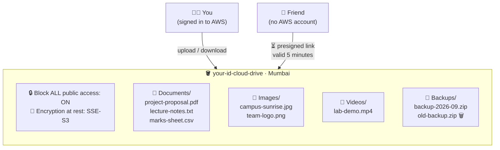
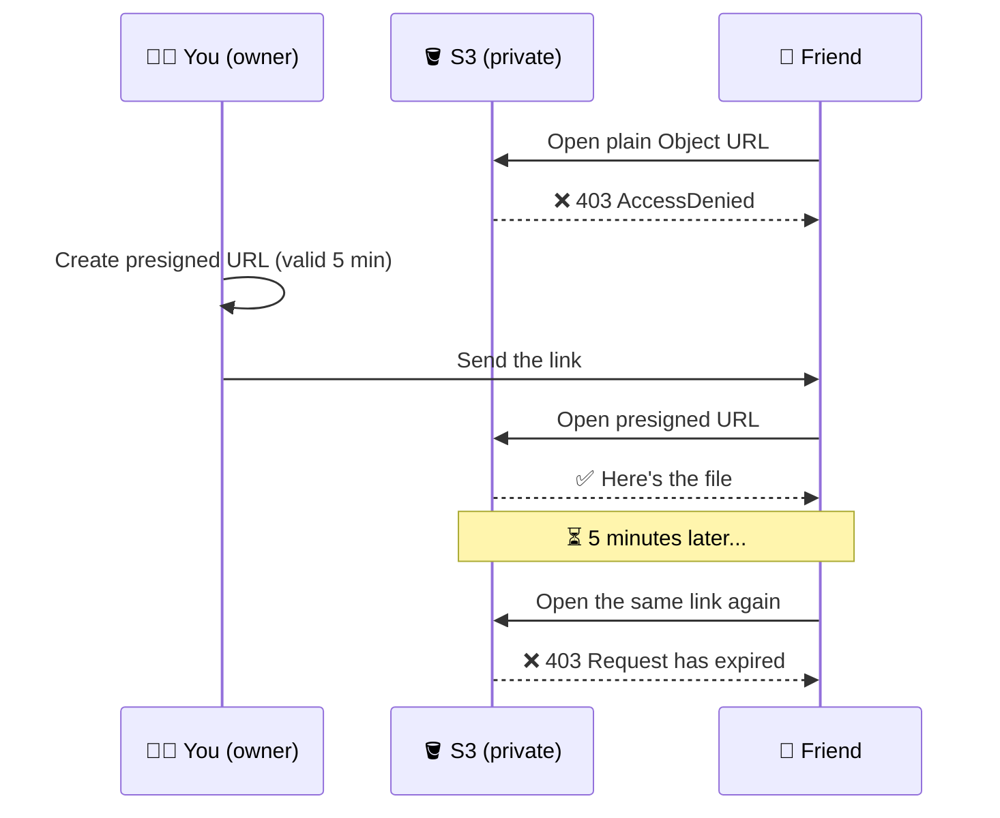

# Lab 3 · Private Cloud Drive: Upload, Download and Share Securely

⏱️ **45 minutes** · 🎯 **Goal:** Build your own private "Google Drive" on Amazon S3, and share files with links that **expire on their own**.

[🏠 Home](../README.md) · [← Lab 2](../lab-02-personal-website/README.md) · Next: [Lab 4 →](../lab-04-assignment-submission/README.md)

**Syllabus tasks covered:** create an S3 bucket · folders for Documents, Images, Videos and Backups · upload different file types · delete a file and verify it's gone · share securely · document the bucket structure

---

## 🧠 Concept in 60 seconds

**Amazon S3 (Simple Storage Service)** stores files, called **objects**, inside containers called **buckets**. It is built to be extremely durable (99.999999999%, "eleven nines"), and it stores trillions of objects for companies like Netflix and Airbnb.

| Everyday word | S3 word |
|---|---|
| Drive / root folder | **Bucket** (its name is unique across *all* of AWS worldwide) |
| File | **Object** |
| File path | **Key**, e.g. `Documents/lecture-notes.txt` |
| Folder | **Prefix**, the part of the key before the `/` |

> [!NOTE]
> S3 has no real folders. `Documents/` is just the start of the name. The console *shows* it as a folder to make things easier for us.

## 🏗️ Architecture



---

## Step 1 · Create your bucket

1. Search **`S3`** → **Create bucket**.
2. Fill in:

   | Setting | Value | Why |
   |---|---|---|
   | AWS Region | **Asia Pacific (Mumbai) ap-south-1** | Close to us |
   | Bucket type | **General purpose** | |
   | Bucket name | `<your-id>-cloud-drive` e.g. `r23bsc042-cloud-drive` | Must be unique worldwide |
   | Object Ownership | **ACLs disabled (recommended)** | Permissions come from policies only |
   | Block Public Access | ✅ **Block *all* public access** | 🔒 Nobody on the internet can read your files |
   | Bucket Versioning | Disable | (We'll use versioning in Lab 4) |
   | Default encryption | **SSE-S3** | 🔐 Files are encrypted on AWS's disks |

3. Click **Create bucket**.

> [!TIP]
> "Bucket name already exists"? Someone in the world already uses that name. Add a suffix such as `-1`.

✅ **Checkpoint:** Your bucket appears in the list, with the region *Asia Pacific (Mumbai)*.

---

## Step 2 · Create the folders

Open your bucket. For each name below, click **Create folder** → type the name → **Create folder**:

`Documents` · `Images` · `Videos` · `Backups`

✅ **Checkpoint:** You see four folders.

---

## Step 3 · Upload different types of files

Use the files in [`sample-files/cloud-drive/`](../sample-files/cloud-drive/) from the ZIP you downloaded, or your own files.

1. Open the **Documents** folder → **Upload** → **Add files** → select `project-proposal.pdf`, `lecture-notes.txt` and `marks-sheet.csv` → **Upload** → **Close**.
2. Do the same for:

   | Folder | Files |
   |---|---|
   | Images | `campus-sunrise.jpg`, `team-logo.png` |
   | Videos | `lab-demo.mp4` |
   | Backups | `backup-2026-09.zip`, `old-backup.zip` |

> [!TIP]
> You can also **drag and drop** files from File Explorer straight onto the S3 page.

3. Click on **`Documents/project-proposal.pdf`** and look at its **Properties**:
   - **Size**, **Type** (`application/pdf`), **Last modified**
   - **Server-side encryption**: *SSE-S3*. The file is encrypted at rest.
   - **Object URL**: its address on the internet. Copy it.

✅ **Checkpoint:** Every folder has its files, and each file shows the right Type (pdf, text, image, video, zip).

📸 **Screenshot:** One folder's file list, and the Properties of one object.

---

## Step 4 · 💥 Prove your files are private

Paste the **Object URL** you copied into a new browser tab.

❌ You'll see:

```xml
<Error>
  <Code>AccessDenied</Code>
  <Message>Access Denied</Message>
</Error>
```

**That's what we want!** Block Public Access is working, and nobody can read your files just by knowing the URL.

Now go back to the object and click the **Open** button instead. ✅ It opens. Why is that different? Because you're signed in to the console, and the console quietly creates a **signed link** for *you*. That's exactly what we'll use to share files next.

📸 **Screenshot:** The AccessDenied error.

---

## Step 5 · Download a file

Select `Images/campus-sunrise.jpg` → **Download**. Open it from your Downloads folder.

✅ **Checkpoint:** The image opens on your PC.

---

## Step 6 · 🔗 Share securely with a link that expires

How do you share **one** file with a friend who doesn't have an AWS account, without making the bucket public? You use a **presigned URL**: a link with a digital signature and an **expiry time** built in.



1. Select `Documents/project-proposal.pdf`.
2. **Object actions** → **Share with a presigned URL**.
3. Time interval until the URL expires: **Minutes → `5`** → **Create presigned URL**. The link is copied to your clipboard.
4. Open an **Incognito / InPrivate window** (`Ctrl + Shift + N`), where you're *not* signed in to AWS, and paste the link. ✅ The PDF opens.
5. Send the link to the person next to you and let them open it on their phone. ✅
6. ⏳ **Wait 5 minutes** (carry on with Step 7), then open the link again.

✅ **Checkpoint:** After 5 minutes the same link shows **`Request has expired`**.

📸 **Screenshot:** The file opening in incognito, and later the *Request has expired* error.

> [!NOTE]
> Look at the link: it contains `X-Amz-Expires=300` (300 seconds) and `X-Amz-Signature=...`. If anyone changes even one character, the signature stops matching and S3 refuses the request.

---

## Step 7 · Delete a file and verify it's gone

1. Open **Backups/** → select **`old-backup.zip`** → **Delete**.
2. Type **`permanently delete`** to confirm → **Delete objects** → **Close**.
3. Refresh the **Backups/** folder.

✅ **Checkpoint:** Only `backup-2026-09.zip` remains.

> [!WARNING]
> Versioning is **off** in this bucket, so this delete is **permanent**, with no recycle bin. In Lab 4 you'll turn on versioning and see how it protects you from mistakes.

📸 **Screenshot:** The Backups folder after the delete.

---

## Step 8 · Document the bucket structure

Open **CloudShell** (the `>_` icon) and run:

```bash
aws s3 ls s3://$ID-cloud-drive --recursive --human-readable --summarize
```

You get every object with its size, plus a **Total Objects** and **Total Size** summary at the end. Copy this into your report as your "storage organisation" table.

✅ **Checkpoint:** 8 objects listed (`old-backup.zip` isn't there).

> [!TIP]
> If `$ID` is empty, type your bucket name in full instead: `s3://r23bsc042-cloud-drive`.

📸 **Screenshots for your report:**

- [ ] Bucket settings: Block Public Access ON and encryption SSE-S3 (in the **Permissions** and **Properties** tabs)
- [ ] The four folders with files in them
- [ ] AccessDenied on the plain Object URL
- [ ] The presigned URL working, and then expired
- [ ] The Backups folder after the delete
- [ ] The CloudShell listing with its totals

---

## 🚀 Power-up: do it all from the command line

<details>
<summary>Upload, list, download and share with the AWS CLI (in CloudShell)</summary>

```bash
# Create a file and upload it
echo "Hello from CloudShell!" > hello.txt
aws s3 cp hello.txt s3://$ID-cloud-drive/Documents/

# List one folder
aws s3 ls s3://$ID-cloud-drive/Documents/

# Download it back under a new name
aws s3 cp s3://$ID-cloud-drive/Documents/hello.txt ./downloaded.txt && cat downloaded.txt

# Create a presigned link valid for 2 minutes (120 seconds)
aws s3 presign s3://$ID-cloud-drive/Documents/hello.txt --expires-in 120

# Delete it
aws s3 rm s3://$ID-cloud-drive/Documents/hello.txt
```
</details>

---

## 🧠 Check your understanding

<details>
<summary><b>1. What is the difference between a bucket, an object and a key?</b></summary>

A **bucket** is the container (its name is globally unique). An **object** is a file plus its metadata. The **key** is the object's full name inside the bucket, e.g. `Documents/lecture-notes.txt`.
</details>

<details>
<summary><b>2. Why did the Object URL give AccessDenied, but the Open button worked?</b></summary>

The bucket blocks all public access, so an **anonymous** request (the plain URL) is denied. The **Open** button generates a **signed** request using *your* signed-in identity, which has permission.
</details>

<details>
<summary><b>3. Why is a presigned URL safer than making the bucket public?</b></summary>

It gives access to **one object**, for a **limited time**, and it can't be changed without breaking the signature. Making the bucket public exposes **every** file to **anyone**, **forever**.
</details>

<details>
<summary><b>4. What is SSE-S3?</b></summary>

**Server-Side Encryption with S3-managed keys.** S3 encrypts every object before writing it to disk and decrypts it when an authorised user reads it. AWS manages the keys. It's on by default for all new buckets.
</details>

<details>
<summary><b>5. Are S3 "folders" real directories?</b></summary>

No. S3 is a **flat** store of keys. A "folder" is just a common **prefix** (like `Documents/`) that the console displays as a folder.
</details>

---

[🏠 Home](../README.md) · [← Lab 2](../lab-02-personal-website/README.md) · Next: [Lab 4 · Assignment Submission Box →](../lab-04-assignment-submission/README.md)
