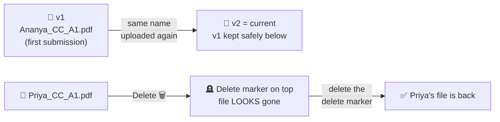
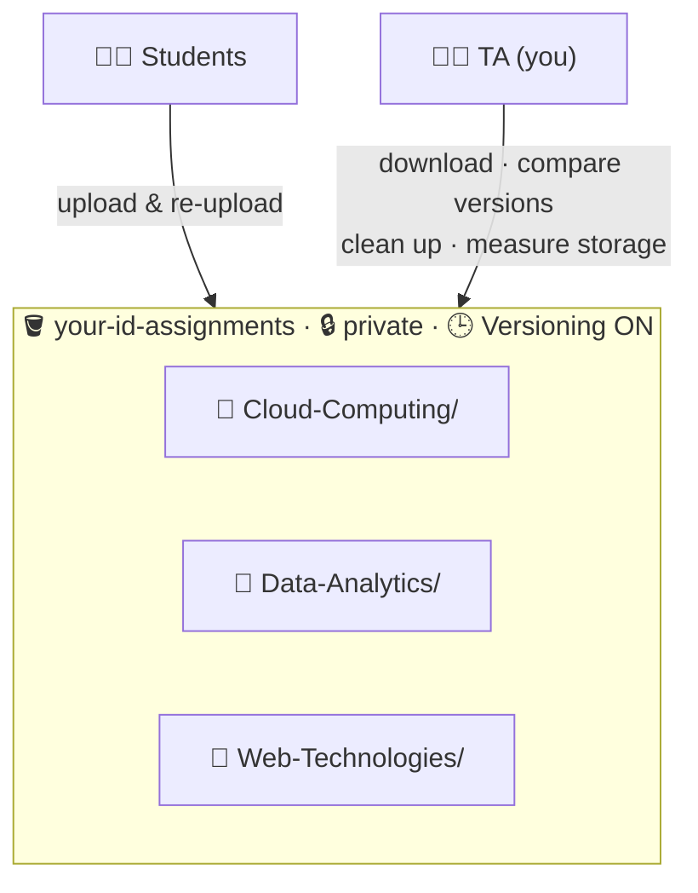

# Lab 4 · Assignment Submission Box with Versioning

⏱️ **45 minutes** · 🎯 **Goal:** Build a cloud submission system that **keeps every earlier version** of a file and lets you **undo an accidental delete**.

[🏠 Home](../README.md) · [← Lab 3](../lab-03-private-cloud-drive/README.md) · Next: [Lab 5 →](../lab-05-image-gallery/README.md)

**Syllabus tasks covered:** create a bucket and subject folders for assignment submissions · upload assignments into their folders · enable Bucket Versioning to track updated submissions · download assignments for evaluation · delete outdated or duplicate files · calculate total storage used · report with screenshots

---

## 🎭 The story

You're the **Teaching Assistant** for three B.Sc. subjects. Students send their assignments, and you store them in S3. Then things get messy, the way they do in real life:

- 😅 **Ananya** resubmits her assignment with changes. Which version did she send first?
- 📄 **Rahul** uploads the same file twice.
- 🗑️ **You** delete **Priya's** real submission by mistake while cleaning up.

**Versioning** fixes all three.

## 🧠 Concept in 60 seconds

With **Bucket Versioning** turned on, S3 **never overwrites or truly deletes** a file on its own:

- Uploading a file with the same name adds a **new version** and keeps the old one.
- Deleting a file adds a **delete marker** on top. The file *looks* gone, but its versions are still there.
- Removing the delete marker **brings the file back**.



## 🏗️ Architecture



---

## Step 1 · Create the bucket and subject folders

1. **S3 → Create bucket**:

   | Setting | Value |
   |---|---|
   | Region | **Asia Pacific (Mumbai)** |
   | Bucket name | `<your-id>-assignments` |
   | Block all public access | ✅ ON |
   | Bucket Versioning | **Disable** for now (we'll turn it on in Step 3) |
   | Encryption | SSE-S3 |

2. Open the bucket and **create three folders**: `Cloud-Computing` · `Data-Analytics` · `Web-Technologies`

---

## Step 2 · Upload the submissions

The files are in [`sample-files/assignments/`](../sample-files/assignments/). Each one follows the naming rule `RollNo_Name_Subject_Assignment.pdf`.

| Upload into folder | Files (from the matching sample folder) |
|---|---|
| `Cloud-Computing/` | `R23BSC001_Ananya_CC_A1.pdf`, `R23BSC002_Rahul_CC_A1.pdf`, `R23BSC003_Priya_CC_A1.pdf` + from `to-clean-up/`: `R23BSC002_Rahul_CC_A1 (1).pdf`, `R23BSC003_Priya_CC_A1_old.pdf` |
| `Data-Analytics/` | `R23BSC001_Ananya_DA_A1.pdf`, `R23BSC004_Kiran_DA_A1.pdf` |
| `Web-Technologies/` | `R23BSC002_Rahul_WT_A1.pdf`, `R23BSC005_Meera_WT_A1.pdf` |

✅ **Checkpoint:** `Cloud-Computing/` has **5** files, and the other two folders have **2** each.

📸 **Screenshot:** The `Cloud-Computing/` folder listing.

---

## Step 3 · Enable Bucket Versioning

1. Open the bucket's **Properties** tab.
2. **Bucket Versioning → Edit → Enable → Save changes**.

✅ **Checkpoint:** Bucket Versioning shows **Enabled**.

> [!IMPORTANT]
> Once versioning is enabled it can only be **suspended**, never fully turned off. That's deliberate: it protects your data history.

---

## Step 4 · A student resubmits (a new version is created)

Ananya has sent an **updated** assignment with the **same file name**.

1. Open `Cloud-Computing/` → **Upload** → add **`sample-files/assignments/resubmission/R23BSC001_Ananya_CC_A1.pdf`** → **Upload**.
2. Back in `Cloud-Computing/`, switch on the **Show versions** toggle (above the file list).

You now see **two versions** of `R23BSC001_Ananya_CC_A1.pdf`:

| Version ID | Meaning |
|---|---|
| A long random ID (e.g. `3HL4kqtJlcpXroDTDmJ...`) | The **new** resubmission, now the current version |
| **`null`** | The **original** upload, made *before* versioning was enabled |

> [!NOTE]
> 🤔 **Why "null"?** Files uploaded while versioning was off have no version ID. When you enable versioning, they're kept with the version ID `null`. Every upload after that gets a unique ID.

✅ **Checkpoint:** With **Show versions** on, Ananya's file has 2 rows, and each has its own **Last modified** time.

📸 **Screenshot:** Ananya's file with both versions visible.

---

## Step 5 · Download assignments for evaluation

**The TA's question:** *"The deadline was the first upload. Which version should I grade?"*

1. With **Show versions** on, select the **older** version (`null`) of Ananya's file → **Download**. Open it: it says **VERSION 1**.
2. Select the **newer** version → **Download**. Open it: it says **VERSION 2 (resubmission)**.
3. Compare the two **Last modified** timestamps. That's your proof of *when* each was submitted. ⏱️
4. Switch **Show versions** off and download `R23BSC004_Kiran_DA_A1.pdf` from `Data-Analytics/` for evaluation too.

✅ **Checkpoint:** You have both of Ananya's versions on your PC, and they are clearly different.

<details>
<summary>🚀 Power-up: download a whole subject folder at once (CloudShell)</summary>

The console downloads one file at a time. The CLI can download everything:

```bash
aws s3 cp s3://$ID-assignments/Cloud-Computing/ ./evaluation/Cloud-Computing/ --recursive
ls -l evaluation/Cloud-Computing/
zip -r cc-submissions.zip evaluation/
```

Then **CloudShell → Actions → Download file** → `cc-submissions.zip` to get it onto your PC.
</details>

---

## Step 6 · Delete outdated and duplicate files (and 💥 a mistake!)

### 6a · Clean up

1. Switch **Show versions OFF**.
2. In `Cloud-Computing/`, select the two junk files:
   - `R23BSC002_Rahul_CC_A1 (1).pdf` (duplicate)
   - `R23BSC003_Priya_CC_A1_old.pdf` (outdated)
3. **Delete** → type **`delete`** → **Delete objects**.

### 6b · 💥 Oops: delete the wrong file

While cleaning up, you **accidentally** delete Priya's *real* submission as well:

4. Select **`R23BSC003_Priya_CC_A1.pdf`** → **Delete** → type `delete` → **Delete objects**.

Priya messages you in a panic: *"My assignment is gone from the system!"* 😱 Without versioning, it would be gone for good.

### 6c · Undo the delete

5. Switch **Show versions ON**.
6. Above Priya's file you'll see a row with the type **Delete marker**. This is what's hiding it.
7. Select **only the Delete marker** row → **Delete** → type **`permanently delete`** → **Delete objects**.
8. Switch **Show versions OFF**.

✅ **Checkpoint:** `R23BSC003_Priya_CC_A1.pdf` is **back**! 🎉

📸 **Screenshot:** The delete marker, and then Priya's restored file.

### 6d · Permanently remove the junk

The two junk files are hidden but still use storage underneath. To remove them for good:

9. **Show versions ON** → select **every row** (the delete marker **and** the file version) belonging to `R23BSC002_Rahul_CC_A1 (1).pdf` and `R23BSC003_Priya_CC_A1_old.pdf`.
10. **Delete** → type `permanently delete` → **Delete objects**.

✅ **Checkpoint:** With **Show versions ON**, neither junk file appears anywhere.

---

## Step 7 · Calculate the total storage used

### Option A · In the console

1. Go to the bucket's root (the **Objects** tab), with Show versions **off**.
2. Tick the checkbox at the top to **select all three folders**.
3. **Actions → Calculate total size**.

You'll see the **Total number of objects** and the **Total size**.

📸 **Screenshot:** The *Calculate total size* summary.

> [!NOTE]
> The bucket's **Metrics** tab also shows total size and object count, but AWS updates it only **once a day**. Today it will look empty, so check it again tomorrow.

### Option B · In CloudShell (with a surprise)

```bash
# Size of the CURRENT files only
aws s3 ls s3://$ID-assignments --recursive --summarize --human-readable

# Size of EVERY version, including the old ones kept by versioning (in bytes)
aws s3api list-object-versions --bucket $ID-assignments --query "sum(Versions[].Size)"
```

🤔 The second number is **bigger**. Ananya's old version still takes up space. **You pay for every version you keep.**

<details>
<summary>🚀 Power-up: clear out old versions automatically with a Lifecycle rule</summary>

1. Bucket → **Management** tab → **Create lifecycle rule**.
2. Name: `expire-old-versions` · Scope: **Apply to all objects in the bucket** (tick the acknowledgement).
3. Actions: ✅ **Permanently delete noncurrent versions of objects**.
4. Days after objects become noncurrent: `30` → **Create rule**.

Now S3 deletes old versions 30 days after they're replaced. You keep a safety window without paying forever. This is how companies manage backups.
</details>

---

## Step 8 · Prepare your report

📸 **Screenshots checklist:**

- [ ] Folder structure (the three subject folders)
- [ ] Files uploaded in `Cloud-Computing/`
- [ ] Bucket Versioning **Enabled** (Properties tab)
- [ ] Ananya's two versions (Show versions ON)
- [ ] The delete marker, and Priya's restored file
- [ ] The *Calculate total size* result
- [ ] The CloudShell output with both size totals

Use the [report template](../resources/report-template.md).

---

## 🧠 Check your understanding

<details>
<summary><b>1. What happens when you upload a file with the same name into a versioned bucket?</b></summary>

S3 stores it as a **new version** with a new version ID and makes it the current version. The previous version is kept and can still be downloaded or restored.
</details>

<details>
<summary><b>2. What is a delete marker?</b></summary>

A placeholder that S3 adds when you delete an object in a versioned bucket (without choosing a version). It makes the object **look** deleted, but earlier versions still exist. Deleting the delete marker restores the object.
</details>

<details>
<summary><b>3. Why did Ananya's first version show the Version ID "null"?</b></summary>

It was uploaded **before versioning was enabled**. Objects that already existed are kept with the version ID `null`. Only uploads made after enabling get unique version IDs.
</details>

<details>
<summary><b>4. What is the downside of versioning, and how do you manage it?</b></summary>

Every version is billed as storage, so costs grow over time. **Lifecycle rules** can delete noncurrent versions automatically (or move them to cheaper storage classes) after a set number of days.
</details>

<details>
<summary><b>5. How can versioning help prove a student submitted on time?</b></summary>

Each version has its own **Last modified** timestamp, recorded by AWS. A student can't change it, so it's reliable proof of when each submission was made.
</details>

---

[🏠 Home](../README.md) · [← Lab 3](../lab-03-private-cloud-drive/README.md) · Next: [Lab 5 · Cloud Image Gallery →](../lab-05-image-gallery/README.md)
