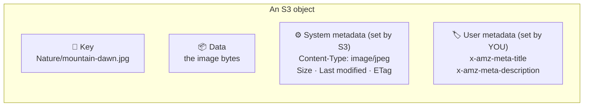
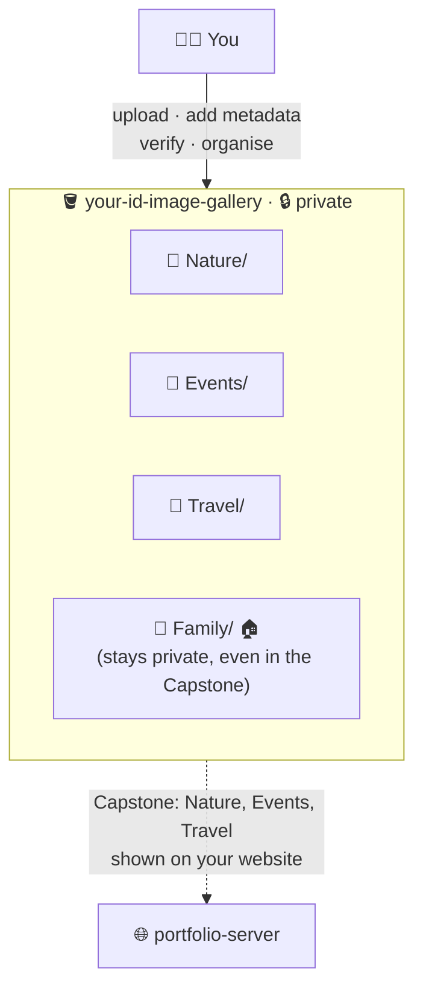
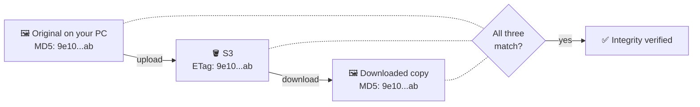

# Lab 5 · Cloud-Based Image Gallery Using Amazon S3

⏱️ **45 minutes** · 🎯 **Goal:** Build a photo library in S3 with albums, **titles and descriptions stored as metadata**, and checks that prove your photos haven't changed.

[🏠 Home](../README.md) · [← Lab 4](../lab-04-assignment-submission/README.md) · Next: [Capstone →](../capstone-live-portfolio-gallery/README.md)

**Syllabus tasks covered:** create an `image-gallery` bucket · folders Nature, Events, Travel and Family · upload images · add metadata (title, description) · download images and verify their integrity · delete unwanted images and organise the gallery · document it with screenshots

> [!IMPORTANT]
> This bucket powers your **live website** in the Capstone. The titles and descriptions you add here will appear on it, so make them good! ✨

---

## 🧠 Concept in 60 seconds

Every S3 object has three parts:



- **Metadata** is information *about* the file, stored alongside it. Apps can read it without opening the image.
- The **ETag** is a fingerprint of the file's contents. For normal uploads it's the file's **MD5 hash**. If even one pixel changes, the fingerprint changes completely.

## 🏗️ Architecture



---

## Step 1 · Create the gallery bucket

**S3 → Create bucket**:

| Setting | Value |
|---|---|
| Region | **Asia Pacific (Mumbai)** |
| Bucket name | `<your-id>-image-gallery` |
| Block all public access | ✅ ON (yes, even for a gallery, as you'll see in the Capstone) |
| Versioning | Disable |
| Encryption | SSE-S3 |

---

## Step 2 · Create the albums

Create four folders, **spelled exactly like this** (capital first letter):

`Nature` · `Events` · `Travel` · `Family`

---

## Step 3 · Upload images

Use your **own photos** 📱 (campus, trips, food, friends) or the ones in [`sample-files/gallery/`](../sample-files/gallery/).

| Folder | Sample files |
|---|---|
| `Nature/` | `mountain-dawn.jpg`, `forest-lake.jpg`, `starry-night.jpg` + **`beach-sunset.jpg`** ⚠️ *(put it here on purpose; it belongs in Travel and you'll move it in Step 6)* |
| `Events/` | `fest-balloons.jpg`, `tech-talk.jpg`, `graduation-day.jpg`, **`blurry-shot.jpg`** *(a bad photo we'll delete later)* |
| `Travel/` | `city-lights.jpg`, `road-trip.jpg` |
| `Family/` | `family-picnic.jpg`, `festival-lights.jpg` |

> [!TIP]
> 🤳 **Make it personal:** take a photo of your lab right now with your phone, email or WhatsApp it to yourself, and upload it to **Events/**. It will appear on your website in the Capstone.

✅ **Checkpoint:** All four folders have images. Click any image → **Open** to preview it.

📸 **Screenshot:** The four album folders, and one album's contents.

---

## Step 4 · Add metadata (title and description)

Give **at least 3 photos** a title and a description (one from each of Nature, Events and Travel):

1. Click the image (e.g. `Nature/mountain-dawn.jpg`) → **Object actions → Edit metadata**.
2. **Add metadata** → Type **User defined** → Key **`title`** → Value e.g. `Dawn over the Western Ghats`
3. **Add metadata** again → Type **User defined** → Key **`description`** → Value e.g. `First light over the hills, 6 AM`
4. **Save changes**.

> [!NOTE]
> The console adds the prefix `x-amz-meta-` for you, so the stored names are `x-amz-meta-title` and `x-amz-meta-description`. Use exactly `title` and `description` (lowercase), because the Capstone looks for these names.

5. Open the object's **Properties** tab and scroll to **Metadata**. You'll see your two entries next to the system metadata (`Content-Type: image/jpeg`).

✅ **Checkpoint:** At least 3 images show `x-amz-meta-title` and `x-amz-meta-description`.

📸 **Screenshot:** The Metadata section of one image.

<details>
<summary>🚀 Power-up: add metadata while uploading, from the CLI</summary>

```bash
# In CloudShell: upload a file with metadata in one command
aws s3 cp mountain-dawn.jpg s3://$ID-image-gallery/Nature/mountain-dawn.jpg \
  --metadata title="Dawn over the Western Ghats",description="First light, 6 AM"

# Read the metadata back
aws s3api head-object --bucket $ID-image-gallery --key Nature/mountain-dawn.jpg --query Metadata
```
(Use CloudShell's **Actions → Upload file** to get an image into CloudShell first.)
</details>

---

## Step 5 · Download an image and verify its integrity

How do you know the photo you download is **exactly** the one you uploaded, not corrupted or tampered with? You compare **fingerprints (hashes)**.



1. **Original:** open **PowerShell** on your lab PC (Start → type *PowerShell*), go to the folder with your images, and hash one:

   ```powershell
   cd "$HOME\Downloads\reva-cloud-labs-main\sample-files\gallery\Nature"
   Get-FileHash .\mountain-dawn.jpg -Algorithm MD5
   ```

   Change the `cd` path to wherever you extracted the ZIP. Tip: in File Explorer, open the folder, click the address bar, copy the path, and paste it after `cd`.
   (On Mac: `md5 mountain-dawn.jpg` · On Linux: `md5sum mountain-dawn.jpg`)

2. **In S3:** open `Nature/mountain-dawn.jpg` → **Properties** → copy the **Entity tag (ETag)**.
3. **Downloaded copy:** click **Download**, then hash the downloaded file:

   ```powershell
   Get-FileHash "$HOME\Downloads\mountain-dawn.jpg" -Algorithm MD5
   ```

4. Compare the three values. PowerShell prints UPPERCASE and S3 prints lowercase, which is fine: they're the same hex value.

✅ **Checkpoint:** All three fingerprints are **identical**. ✅ Integrity verified.

> [!NOTE]
> You may also see a **CRC64NVME** checksum on the object. S3 now adds this extra fingerprint to new uploads automatically and checks it every time data moves.

<details>
<summary>💥 Break it on purpose: what does tampering look like?</summary>

Make a copy, change just one byte, and hash both:

```powershell
Copy-Item .\mountain-dawn.jpg .\tampered.jpg
Add-Content .\tampered.jpg "x"
Get-FileHash .\mountain-dawn.jpg, .\tampered.jpg -Algorithm MD5
```

A **one-byte** change gives a **completely different** hash. This is called the *avalanche effect*, and it's why hashes are used to detect tampering.
</details>

📸 **Screenshot:** Your three matching hashes.

---

## Step 6 · Organise the gallery

### 6a · Move the misplaced photo

`beach-sunset.jpg` is in **Nature/** but it's a travel photo.

1. Select `Nature/beach-sunset.jpg` → **Actions → Move**.
2. Destination → **Browse S3** → choose your gallery bucket → **Travel/** → **Choose destination** → **Move**.

### 6b · Delete unwanted images

1. Select `Events/blurry-shot.jpg` (plus any of your own photos you don't want) → **Delete** → type `permanently delete` → **Delete objects**.

✅ **Checkpoint:** `beach-sunset.jpg` is in **Travel/**, and `blurry-shot.jpg` is gone.

> [!TIP]
> S3 has no real "move". Behind the scenes the console **copies** the object to the new key and **deletes** the old one. Remember: folders are just name prefixes!

---

## Step 7 · Document your gallery

In **CloudShell**:

```bash
aws s3 ls s3://$ID-image-gallery --recursive --human-readable --summarize
```

📸 **Screenshots for your report:**

- [ ] The four album folders
- [ ] The images inside at least one album
- [ ] The metadata (title/description) of one image
- [ ] The integrity check with three matching hashes
- [ ] The Move dialog, and the final Travel album
- [ ] The CloudShell listing with totals

**Observations to write about:** How are folders really stored in S3? What's the difference between system and user metadata? Why do the hashes prove integrity?

---

## 🧠 Check your understanding

<details>
<summary><b>1. What is the difference between system metadata and user-defined metadata?</b></summary>

**System metadata** is managed by S3: Content-Type, size, Last-Modified, ETag, encryption. **User-defined metadata** is custom key–value information *you* add, stored with the prefix `x-amz-meta-`, such as a title or description.
</details>

<details>
<summary><b>2. What is an ETag, and when is it NOT the MD5 of the file?</b></summary>

An ETag is an identifier S3 gives to an object's contents. For a normal single-part upload with SSE-S3 encryption, it's the **MD5 hash**. For **multipart uploads** (large files sent in pieces) it looks like `abc123...-5` and is **not** a simple MD5. It's also not the MD5 for objects encrypted with **SSE-KMS**.
</details>

<details>
<summary><b>3. Why can't you simply "rename" or "move" a file in S3?</b></summary>

An object's **key is its identity**. Changing the key means creating a new object, so S3 does **copy + delete**. The console's *Move* button does both steps for you.
</details>

<details>
<summary><b>4. Why keep a gallery bucket private if the photos will be on a website?</b></summary>

So **you** decide exactly which photos are published and how. In the Capstone, the web server reads the bucket using an IAM role and publishes only the chosen albums. Family photos never leave the bucket, and nobody can browse or download your whole collection.
</details>

---

[🏠 Home](../README.md) · [← Lab 4](../lab-04-assignment-submission/README.md) · Next: [🏆 Capstone · Live Portfolio + Gallery →](../capstone-live-portfolio-gallery/README.md)
